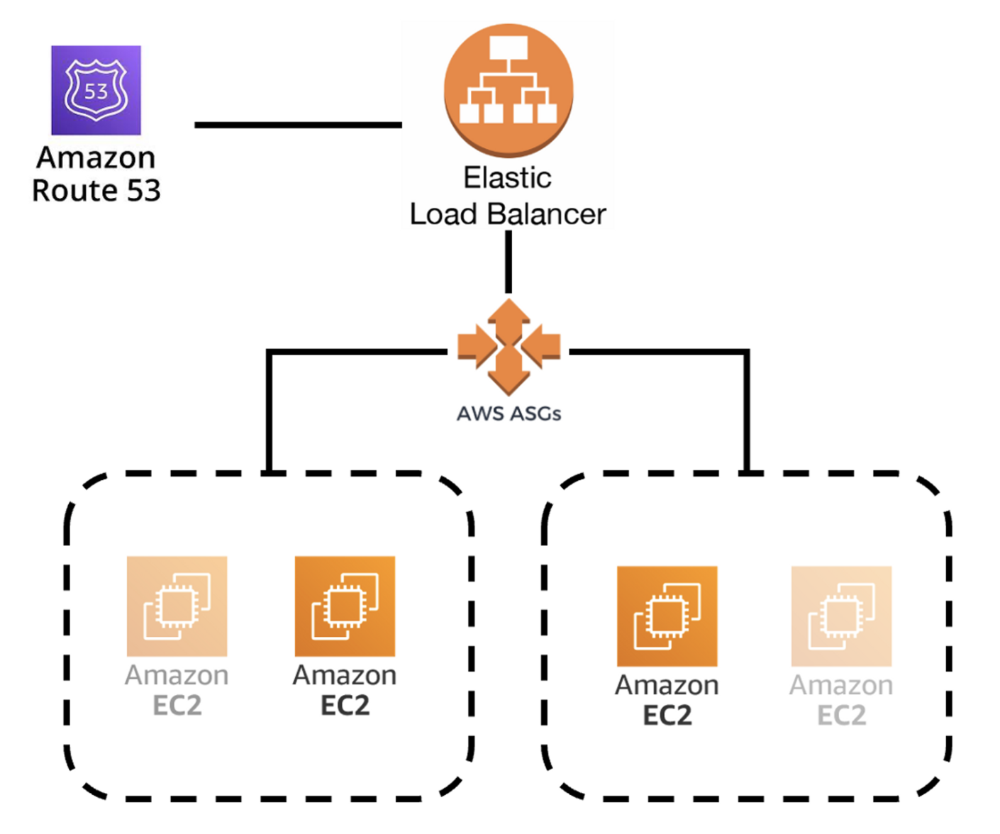
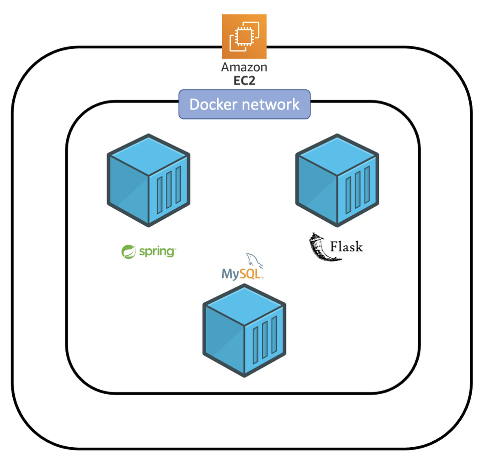
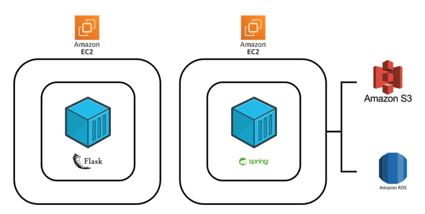
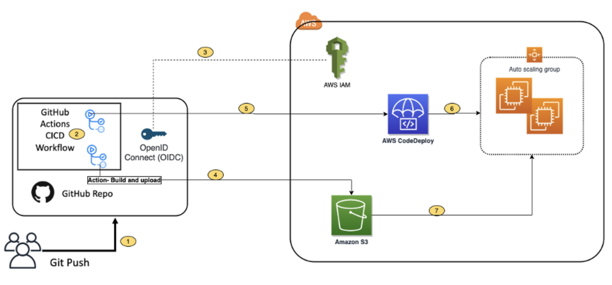
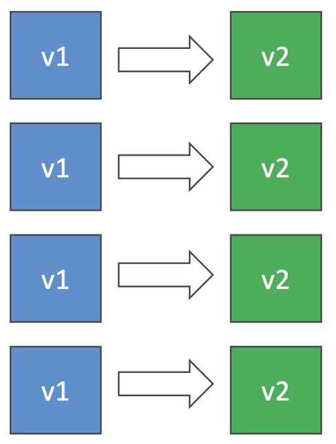
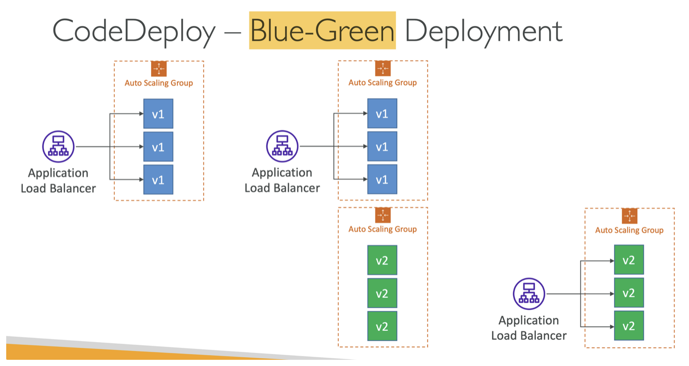
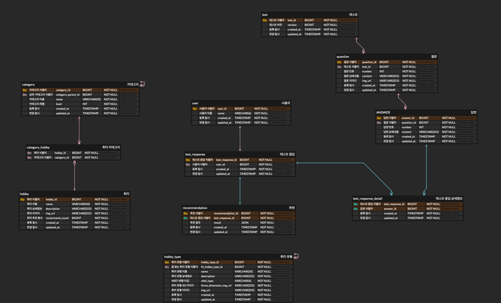

# Hollang-api-server

### 추론 서버: [Hollang-inferring-server](https://github.com/swyg-goorm/inferring_server)

## ⚙️ 개발 환경(Development Environment)

| 분류 | 개발환경                                     | 
|---|------------------------------------------|
| 운영체제 | Mac OS, Linux                            |
| 개발도구 | Intellij IDEA, Gradle, Postman, ERDCloud |
| 프레임워크 | Spring Boot 3.0.0                        |
| 데이터베이스 | MySQL                                    |
| 버전 관리 | Github, Git                              |
| 배포 및 운영 | AWS, Docker, Github Actions              |
| 오픈소스 및 외부 라이브러리 | AWS-SDK                                  |

## 🛠 세부 기술 스택(Tech Stack)

- **Kotlin(JDK 17)**
- **Spring Boot 3.0.2**
    - Spring Web MVC
    - Spring Data JPA
    - Spring Actuator
    - Openfeign

- **AWS(Amazon Web Service)**
    - AWS EC2
    - AWS Route 53
    - AWS Elastic Load Balancing
    - AWS AutoScaling Group
    - AWS RDS
    - AWS S3
    - AWS CodeDeploy

### 데이터베이스(Database)

- **MySQL**

## 인프라 구조 및 CI/CD Pipeline

### 전체 구조

- EC2 인스턴스 하나에 도커 컨테이너 3개(API Server, Inferring Server, MySQL Server)를 띄워서 관리할 수 있도록 구성하였다.
  - 각각의 컨테이너들은 독립적으로 구성되지만, 하나의 도커 네트워크를 이용하여 각각의 IP로의 통신이 아닌 컨테이너 이름으로의 통신이 가능하도록 설계하였다. → IP로의 통신은 컨테이너를 띄울때 변할수 있기 때문에 IP로의 통신은 구성하지 않았다.
  - API Server가 띄워져있는 애플리케이션을 제외한 나머지 컨테이너들은 Public으로 노출하지 않아서 외부로부터 트래픽을 받을 수 없게 설계하였다.
  - MySQL 서버는 MySQL Docker 공식 이미지를 받아와서 띄웠고, 데이터베이스의 데이터들은 컨테이너가 종료되어도 유지하도록 Docker Named Volume을 사용하여 인스턴스 종료시까지 유지할 수 있도록 하였다.
- EC2로의 인바운드 트래픽은 관리자가 인스턴스로 접속하여 관리할 수 있도록 SSH Port(22)를 열어서 Private Key를 보유한 관리자가 접속할 수 있도록 하였고, 또한 EC2 인스턴스로 직접 접속할 수 없도록 로드밸런서로부터 들어오는 클라이언트 트래픽을 받을 수 있도록 EC2 시큐리티 그룹을 로드밸런서와 공유하였다.

### 개발 환경

- EC2 인스턴스 하나에 도커 컨테이너 3개(API Server, Inferring Server, MySQL Server)를 띄워서 관리할 수 있도록 구성하였다.
  - 각각의 컨테이너들은 독립적으로 구성되지만, 하나의 도커 네트워크를 이용하여 각각의 IP로의 통신이 아닌 컨테이너 이름으로의 통신이 가능하도록 설계하였다. → IP로의 통신은 컨테이너를 띄울때 변할수 있기 때문에 IP로의 통신은 구성하지 않았다.
  - API Server가 띄워져있는 애플리케이션을 제외한 나머지 컨테이너들은 Public으로 노출하지 않아서 외부로부터 트래픽을 받을 수 없게 설계하였다.
  - MySQL 서버는 MySQL Docker 공식 이미지를 받아와서 띄웠고, 데이터베이스의 데이터들은 컨테이너가 종료되어도 유지하도록 Docker Named Volume을 사용하여 인스턴스 종료시까지 유지할 수 있도록 하였다.
- EC2로의 인바운드 트래픽은 관리자가 인스턴스로 접속하여 관리할 수 있도록 SSH Port(22)를 열어서 Private Key를 보유한 관리자가 접속할 수 있도록 하였고, 또한 EC2 인스턴스로 직접 접속할 수 없도록 로드밸런서로부터 들어오는 클라이언트 트래픽을 받을 수 있도록 EC2 시큐리티 그룹을 로드밸런서와 공유하였다.

### 운영 환경

- EC2 인스턴스 하나에 도커 컨테이너 2개(API Server, Inferring Server)를 띄워서 관리할 수 있도록 구성하였다.
  - 각각의 컨테이너들은 독립적으로 구성되지만, 하나의 도커 네트워크를 이용하여 각각의 IP로의 통신이 아닌 컨테이너 이름으로의 통신이 가능하도록 설계하였다. → IP로의 통신은 컨테이너를 띄울때 변할수 있기 때문에 IP로의 통신은 구성하지 않았다.
  - API Server가 띄워져있는 애플리케이션을 제외한 나머지 컨테이너들은 Public으로 노출하지 않아서 외부로부터 트래픽을 받을 수 없게 설계하였다.
  - MySQL 서버를 컨테이너로 띄우지 않는 이유는 AWS RDS를 사용하면 모니터링과 데이터 관리 등 운영하는데 필요한 유용한 기능들을 제공해주고, 인스턴스와 분리하여 메모리를 효율적으로 관리하기 위해서이다.
- 또한 AWS S3 버킷을 생성하여 애플리케이션 전반에 존재하는 이미지들을 저장하고, 배포할때 배포 버전을 관리할 수 있도록 하였다.
  - 각각의 파일들은 버전별로 관리되게 구성하였다.
- EC2로의 인바운드 트래픽은 관리자가 인스턴스로 접속하여 관리할 수 있도록 SSH Port(22)를 열어서 Private Key를 보유한 관리자가 접속할 수 있도록 하였고, 또한 EC2 인스턴스로 직접 접속할 수 없도록 로드밸런서로부터 들어오는 클라이언트 트래픽을 받을 수 있도록 EC2 시큐리티 그룹을 로드밸런서와 공유하였다.

### CI/CD Pipeline

1. 개발자가 GitHub 원격 저장소의 develop 또는 main 브랜치로 Push & Merge를 하면 이벤트 트리거가 작동한다.
2. 이벤트 트리거는 저장소에 존재하는 애플리케이션 소스코드를 다운로드받고 빌드하고 캐시하는 작업을 수행한다.
3. Github의 Open ID Connector(OIDC)는 AWS로부터 액세스 토큰을 요청하고, 받은 토큰을 사용해서 AWS 사용자 자격 증명을 수행하여 자원에 접근할 수 있게된다.
4. 다운로드 받은 애플리케이션을 도커 이미지로 빌드해서 AWS ECR(Elastic Container Registry)에 푸쉬하고, AWS CodeDeploy를 위한 스크립트 파일들을 작성한다. 그리고 다운로드 받은 스크립트 파일들을 하나로 압축해서 AWS S3 버킷에 넣는다.
5. AWS CodeDeploy에서 새로운 배포를 생성한다.
6. 이 과정에서는 develop과 production이 다른 배포 전략으로 배포를 수행한다. 
   - develop 인스턴스는 무중단 배포가 필요없기 때문에 다음과 같이 한번에 새로운 배포를 하는 전략을 사용하여 구축하였다. 일단 CodeDeploy가 실행중이면 해당 인스턴스는 중지상태가 된다. 따라서 배포중에는 어떤 트래픽도 들어오지 못한다. 배포중에는 이전의 도커 컨테이너를 중지시키고 새로운 버전의 이미지로 도커 컨테이너를 띄우는 전략을 사용했다.
     

   - production 인스턴스는 오토스케일링과 로드 밸런서를 이용해서 배포를 수행한다. 배포가 성공적으로 완료되면 오토 스케일링 그룹이 새로운 배포를 위한 새로운 인스턴스를 생성한다. 로드 밸런서는 새로운 버전의 인스턴스가 모든게 성공적으로 완료되면 이전의 인스턴스로 가던 트래픽을 끊고 새로운 인스턴스로의 트래픽을 전달하게 된다. 또한 새로운 버전을 배포하고 서버가 안정화가 되면 오토 스케일링 그룹이 이것을 인식하고 이전 버전의 인스턴스를 종료시킨다.
     
7. 배포하는 과정에서 이전에 S3에 저장했던 스크립트 파일들을 가져온다.

## 📝 테이블 정의서(Entity Details)

[Table Description](./readme_files/Hollang_table_desc.pdf)

## 🔗 엔티티-관계 모델(Entity Relationship Diagram)

